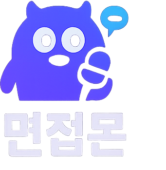
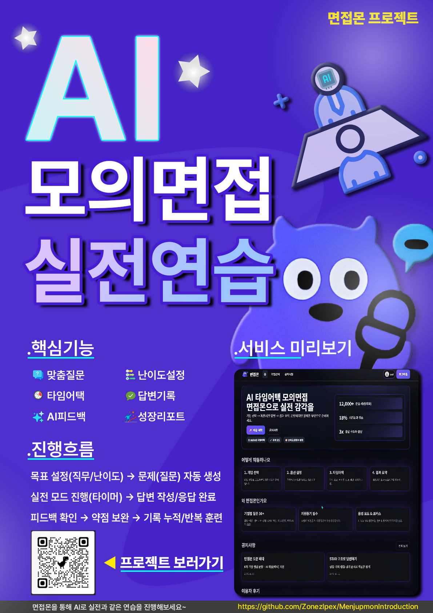

<p align="center">
  
</p>

<p align="center">
  <a href="https://github.com/alstlr0307/interviewmon-front">
    
  </a>
  &nbsp;&nbsp;
  <a href="https://github.com/alstlr0307/interviewmon-api">
    
  </a>
</p>

<p align="center">
  
</p>

<p align="center">
  
  
  
  
  
</p>

---

# Menjupmon (면접몬)
집에서도 **실전형 모의면접**을 진행하고, 답변 기반으로 **즉시 피드백(점수/요약/개선점)**을 받는 웹 프로젝트입니다.  
질문 → 답변 → 피드백 → 기록 저장 흐름을 한 번에 묶어, 반복 연습 효율을 올리는 것을 목표로 했습니다.

---

## 0) Quick Links
- Frontend Repo: `https://github.com/alstlr0307/interviewmon-front`
- Backend Repo: `https://github.com/alstlr0307/interviewmon-api`
- 프로젝트 소개 PDF: `./면접몬 프로젝트.pdf`
- 간단 소개 PDF: `./간단소개.pdf`, `./간단소개2.pdf`
- 포스터: `./면접몬포스터파일.png`
- 로고: `./로고.png`, `./누끼로고.png`

> 이 레포는 “소개/문서/시각 자료” 중심입니다. 실제 구현 코드는 Front/Back 레포에서 관리합니다.

---

## 1) 포스터 / 한눈에 보기

<table>
  <tr>
    <td width="58%" align="center">
      
      <br />
      <sub><b>면접 연습 흐름(질문 → 답변 → 피드백 → 기록)을 한 화면 컨셉으로 정리</b></sub>
    </td>
    <td width="42%">
      <h3>핵심 요약</h3>
      <ul>
        <li><b>문제 정의</b>: 피드백 부재/기록 부재로 연습 효율이 떨어짐</li>
        <li><b>해결</b>: 답변 제출 즉시 피드백 + 세션/기록 저장</li>
        <li><b>학습 방식</b>: 타임어택 형태의 문항 진행 + 음성 기반 연습(STT/TTS)</li>
        <li><b>확장성</b>: 기업/직무 질문 풀 기반으로 유형/랜덤 출제 확장</li>
      </ul>
      <hr />
      <h3>문서(증빙)</h3>
      <ul>
        <li><code>면접몬 프로젝트.pdf</code>: 전체 소개/흐름/화면 캡처</li>
        <li><code>간단소개.pdf</code>, <code>간단소개2.pdf</code>: 요약 브리핑용</li>
      </ul>
    </td>
  </tr>
</table>

---

## 2) 사용자 흐름
- 회원가입/로그인
- 문항/난이도(시간 제한) 선택
- 질문 진행(타임어택)
- 답변 입력(텍스트/음성) → 제출
- AI 피드백 생성(점수/요약/개선점)
- 기록 저장(세션/히스토리) → 재도전/비교

---

## 3) 핵심 기능

### 3.1 타임어택 모의면접
- 문항 수/난이도(시간 제한)를 선택하고 질문을 순서대로 진행
- 진행 중 상태는 저장되어 중단 후 재개 가능한 흐름을 고려

### 3.2 음성 기반 연습(STT) + 질문 읽기(TTS)
- 브라우저 Web Speech API 활용
- 말로 연습한 내용도 텍스트 기록(자막) 형태로 남겨 복습 가능

### 3.3 AI 피드백(점수 + 코칭)
- 답변을 기반으로 항목별 점수/요약/개선 포인트 출력
- 피드백 결과는 기록으로 저장되어 회고/비교에 사용

### 3.4 질문 풀 확장(운영 관점)
- 기업/직무별 질문 풀 기반으로 유형별/랜덤 출제 확장 가능하도록 설계 방향 반영

---

## 4) 시스템 구조

```mermaid
flowchart TB
  U[User] --> FE[Frontend (React/TS)]
  FE -->|REST API| BE[Backend (Node/Express)]
  BE --> DB[(MySQL)]
  BE --> AI[(OpenAI Feedback)]
  FE -->|STT/TTS| WS[Web Speech API]
```

- Frontend: 화면/타이머/인터랙션, STT/TTS 연동, 결과 표시
- Backend: 인증/보안, 답변 수집/저장, 피드백 요청/정리, 기록 조회
- DB: 사용자/기록/질문 데이터 관리

---

## 5) 기술 스택
- **Frontend**: React(CRA), TypeScript, react-router-dom, axios, framer-motion, recharts
- **Backend**: Node.js, Express, MySQL(mysql2), JWT(jsonwebtoken), bcryptjs, zod
- **Security/Ops**: helmet, express-rate-limit, morgan
- **AI**: OpenAI SDK

---

## 6) 팀
- 신민수: 프로젝트 총괄, 백엔드 개발, 설계/발표
- 김민식: 백엔드 개발, DB 설계, 유지보수
- 이준환: 프론트엔드 개발, UI/발표자료 보조

---

## 7) 자료(이 레포)
- `면접몬 프로젝트.pdf`
- `간단소개.pdf`
- `간단소개2.pdf`
- `면접몬포스터파일.png`
- `로고.png`, `누끼로고.png`

<details>
<summary><b>PDF를 README에 “이미지 중심”으로 바꾸는 운영 팁</b></summary>

- PDF 내 화면 캡처를 PNG로 추출 → `img/` 폴더에 정리  
- README에 “화면 갤러리(썸네일 테이블)” 섹션 추가  
- 문서 링크는 유지하고, 대표 화면 6~9장만 썸네일로 노출하면 가독성이 가장 좋습니다.

</details>

---
